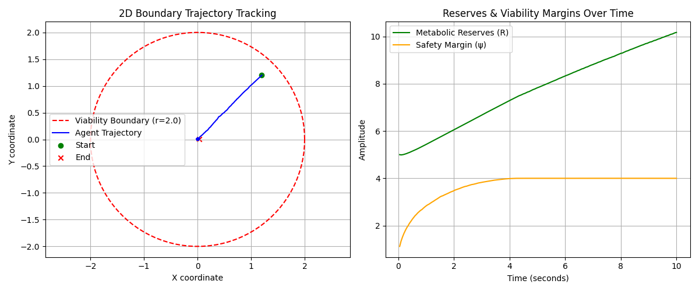

# `cps` — Coupled Persistence System

`cps` is a Python library for viability-aware coordination, resource allocation, and algebraic stabilization of autonomous dynamical systems . 

Operating on generic vector spaces, `cps` bridges continuous-discrete state transitions to provide formal mechanisms for governing control loops under strict metabolic, resource, and latency constraints .

## Results

Running the tutorial produces the following behavior — the agent 
navigates toward the center under constant drift and noise, 
never crossing the viability boundary:



> Full tutorial code in [`tutorial.py`](tutorial.py)

---

## 1. Core Architectural Constraints

To guarantee predictability and safety when coordinating autonomous processes, `cps` is designed under strict systems-runtime constraints :

* **Zero Arbitrary Execution:** The core library does not use `eval()`, `exec()`, or dynamic imports from user-supplied strings .
* **No Autonomous Shell Access:** Core primitives contain zero `subprocess` or `os.system` calls . High-level adapters requiring system execution are isolated under `cps.unsafe` .
* **No Network Dependencies:** The core package `cps.core` depends exclusively on `numpy`, `scipy`, and standard typing utilities .
* **Bounded State Execution:** Trajectory updating ($C_t$) uses bounded recursion limits (`MAX_RECURSION_DEPTH = 128`) to prevent stack-overflow failures .
* **Action Sandboxing:** All actuator and controller outputs are initially produced as abstract, symbolic transform vectors to prevent unintended environmental mutations .
* **Determinism & Auditing:** The core scheduling loop runs without hidden background threads or asynchronous drift . Every state transition can optionally record immutable `StateAuditLog` traces for diagnostic auditing .

---

## 2. Multi-Domain Applications (With Implementation Examples)

By treating coordination as an abstract mathematical filtering layer, `cps` can be applied to diverse computational and simulated systems .

### A. Robotic Swarms (Coordination & Collision Avoidance)
In swarm robotics, agents must navigate toward targets while maintaining physical separation bounds (spatial viability envelopes) and conserving finite battery reserves . The Constrained Orthant Lattice (COL) prevents contradictory control vectors when avoiding neighbors while pursuing global path objectives .

```python
import numpy as np
from cps import ViabilityField, ConstrainedOrthantLattice, Automaton, Ct, Coordinator

def create_swarm_agent(agent_id: int, initial_pos: np.ndarray, initial_battery: float):
    # The viability margin defines safe operating boundaries (e.g., stay within a 10m radius arena)
    def swarm_boundary(pos: np.ndarray) -> float:
        arena_margin = 100.0 - np.sum(pos ** 2)
        return min(arena_margin, 2.0)

    field = ViabilityField(boundary_fn=swarm_boundary)
    
    # 2D motion (x, y)
    col = ConstrainedOrthantLattice(dimension=2, hysteresis_threshold=0.05)
    ct = Ct(delay=5)
    automaton = Automaton(state=initial_pos, reserve=initial_battery, viability_field=field)
    
    return Coordinator(automaton=automaton, col=col, ct=ct, alpha=1.0, beta=0.5)

# Initialize a small 2-agent swarm
swarm = [
    create_swarm_agent(0, np.array([1.0, -1.0]), 2.0),
    create_swarm_agent(1, np.array([-1.5, 2.0]), 1.8)
]

# Execute a coordinated step under external drift
for coordinator in swarm:
    target_drift = np.array([0.5, 0.2])
    coordinator.step(dt=0.05, environmental_drift=target_drift)
    print(f"Agent Pos: {coordinator.automaton.observe()} | Battery: {coordinator.automaton.reserve:.3f}")
```

### B. Antagonistic Actuator Control & Joint Simulations
Robotic limbs controlled by antagonistic muscle pairs or dual-opposing pneumatic cylinders often waste energy through simultaneous co-contraction . `COL` acts as an algebraic signal rectifier to block opposing torque directions at the controller level .

```python
import numpy as np
from cps import ConstrainedOrthantLattice

class JointTorqueController:
    """
    Controls a single robotic joint with dual-antagonistic actuators.
    """
    def __init__(self):
        # 1D Joint output represented by two channels: [Actuator_A (Pulling), Actuator_B (Pushing)]
        self.col = ConstrainedOrthantLattice(
            dimension=2, 
            hysteresis_threshold=0.1, 
            max_flip_rate=0.3
        )
        
    def filter_control_signals(self, raw_torques: np.ndarray) -> np.ndarray:
        """
        Filters raw motor commands to ensure opposing actuators do not active simultaneously.
        """
        return self.col.project(raw_torques)

controller = JointTorqueController()
# Conflicting input: Attempting to pull and push at the same time due to sensor noise
noisy_input = np.array([2.5, -1.8]) 
stable_output = controller.filter_control_signals(noisy_input)

print(f"Noisy Command: {noisy_input} -> Rectified Joint Torque: {stable_output}")
```

### C. Agentic AI & LLM Orchestration (Token Context & Budget Safety)
Large Language Model (LLM) agent loops are susceptible to infinite recursive execution paths, context window overflows, and runaway API cost consumption . Treating the LLM workspace as an `Automaton` maps memory size to system state and limits API spend via the metabolic reserve .

```python
import numpy as np
from cps import ViabilityField, Automaton, Ct, Coordinator
from cps.exceptions import ReserveExhaustionError

# Define safety thresholds
# State: [Current prompt token count, execution loop count]
def llm_safety_boundary(state: np.ndarray) -> float:
    token_limit_margin = 8192.0 - state[0]
    loop_limit_margin = 15.0 - state
    return min(token_limit_margin, loop_limit_margin)

field = ViabilityField(boundary_fn=llm_safety_boundary)

# Initialize agent with a maximum $5.00 API spend limit
agent_state = np.array([1200.0, 0.0]) # 1200 tokens consumed, 0 steps executed
agent_automaton = Automaton(state=agent_state, reserve=5.00, viability_field=field)
ct = Ct(delay=2) # Maintain state buffer history
col = ConstrainedOrthantLattice(dimension=2)

coordinator = Coordinator(automaton=agent_automaton, col=col, ct=ct, alpha=1.0, beta=0.1)

try:
    for loop in range(10):
        # Simulate active execution loop adding 800 tokens and 1 iteration step
        execution_step = np.array([800.0, 1.0]) 
        coordinator.step(dt=1.0, environmental_drift=execution_step)
        print(f"Step {loop} | Tokens: {agent_automaton.observe()[0]} | Budget Remaining: ${agent_automaton.reserve:.4f}")
except ReserveExhaustionError:
    print("API Budget has exhausted. Process halted to prevent runaway billing .")
```

### D. Agent-Based Models (ABM) (Resource-Bounded Populations)
In economic or demographic agent-based simulations, models must track how entities consume capital under baseline taxes, operating costs, and revenue streams . The metabolic core updates capital trends deterministically .

```python
import numpy as np
from cps.core.metabolism import update_reserve

class MarketAgent:
    """
    An agent in an ABM simulation managing liquid assets.
    """
    def __init__(self, initial_capital: float):
        self.capital = initial_capital
        self.alive = True
        
    def execute_market_cycle(self, operational_costs: float, revenue: float, dt: float):
        # Baseline depreciation rate (e.g. rent/taxes)
        depreciation_rate = 0.05 
        
        self.capital = update_reserve(
            reserve=self.capital,
            action_cost=operational_costs,
            gain=revenue,
            decay_rate=depreciation_rate,
            dt=dt
        )
        if self.capital <= 1e-4:
            self.alive = False

agent = MarketAgent(initial_capital=10.0)
agent.execute_market_cycle(operational_costs=3.0, revenue=0.5, dt=1.0)
print(f"Agent Active: {agent.alive} | Capital Reserve: {agent.capital:.2f}")
```

### E. Artificial Life (ALife) Research (Homeostatic Autonomy)
Researchers modeling physiological homeostasis can track how virtual organisms dynamically scale actions based on distance to survival boundaries (autopoiesis) . The Persistence Operator scales metabolic costs as the agent approaches dehydration or thermal limits .

```python
import numpy as np
from cps import ViabilityField, Automaton, Ct, Coordinator

# State: [Core Temperature Deviation, Hydration Level]
def homeostasis_envelope(state: np.ndarray) -> float:
    temp_margin = 3.0 - abs(state[0])  # Survives temp deviations within +/- 3C
    hydration_margin = state - 0.1   # Survives hydration levels > 0.1
    return min(temp_margin, hydration_margin)

field = ViabilityField(boundary_fn=homeostasis_envelope)

physiological_state = np.array([0.5, 0.8])
metabolic_energy = 3.0

organism = Automaton(state=physiological_state, reserve=metabolic_energy, viability_field=field)
col = ConstrainedOrthantLattice(dimension=2)
ct = Ct(delay=10)

coordinator = Coordinator(automaton=organism, col=col, ct=ct, alpha=1.2, beta=0.5)

# Simulate exposure to external environmental stress
stress = np.array([0.4, -0.3])

for step in range(5):
    coordinator.step(dt=0.2, environmental_drift=stress)
    state = organism.observe()
    print(f"Hour {step} | Temp Dev: {state[0]:.2f}C | Hydration: {state:.2f} | Reserve Energy: {organism.reserve:.2f}")
```

## 🔋 Extracting the Metabolic Layer (BPLA) for Standalone Use

You do not need to use the full `Coordinator` orchestration loop to benefit from the library's resource-aware safety math . You can extract the **Biological Principle of Least Action (BPLA)** layer directly to use as a standalone safety filter in your own projects .

### Standalone Use Case: Thermal Throttling in an IoT Edge Camera
Imagine an edge-computing camera running object detection. 
* **State ($x$):** CPU Temperature (must remain below $80^\circ\text{C}$ to avoid damage) .
* **Reserve ($R$):** Remaining Battery Capacity ($0.0$ to $10.0$ Ah) .
* **BPLA Action ($\mathcal{A}$):** Dynamically scales down the frame processing rate (cool-down effort) strictly proportional to how close the CPU is to overheating, weighted by how much battery life remains .

Here is how to compute this vector directly by calling `cps` core primitives :

```python
import numpy as np
from cps import ViabilityField
from cps.core.gradients import normalized_gradient

# 1. Define the safety boundary (CPU temperature must remain under 80C)
def cpu_thermal_boundary(state: np.ndarray) -> float:
    # State[0] is current CPU temperature
    return 80.0 - state[0]

# Instantiate the viability field to handle margins and gradients 
thermal_field = ViabilityField(boundary_fn=cpu_thermal_boundary)

# 2. Create the standalone BPLA function (Equation 9) 
def compute_bpla_action(
    temperature_state: np.ndarray, 
    battery_reserve: float, 
    alpha: float = 1.2, 
    beta: float = 0.5,
    eps: float = 1e-6
) -> np.ndarray:
    """
    Computes the optimal boundary-avoiding action vector directly.
    """
    # Evaluate current safety margin psi(x) and raw gradient 
    psi = thermal_field.margin(temperature_state)
    raw_gradient = thermal_field.gradient(temperature_state)
    
    # Normalize the direction to keep control forces bounded 
    norm_grad = normalized_gradient(raw_gradient, eps=eps)
    
    # Calculate the BPLA action magnitude:
    # Action scales with available reserves and inversely with safety margin 
    action_scale = np.sqrt((alpha * battery_reserve) / beta) * (1.0 / (max(psi, 0.0) + eps))
    
    return action_scale * norm_grad

# --- Test the Standalone Filter ---
# Case A: CPU is cool (50C) and battery is full (10.0 Ah)
cool_state = np.array([50.0])
action_a = compute_bpla_action(cool_state, battery_reserve=10.0)

# Case B: CPU is hot (79.5C) and battery is low (1.5 Ah)
hot_state = np.array([79.5])
action_b = compute_bpla_action(hot_state, battery_reserve=1.5)

print(f"Cool CPU (Low Urgency) -> Frame throttling action: {action_a[0]:.4f} units")
print(f"Hot CPU  (High Urgency) -> Frame throttling action: {action_b[0]:.4f} units")
```

---

# Oscillation Damping in CPS
 
## What it is
 
Oscillation damping is the mechanism that prevents a controlled agent from flip-flopping direction faster than the system can act on. In CPS terms, an oscillation is a sign change in a state dimension — the velocity in x going from positive to negative and back — within a short time window. The `InstabilityError` fires when this rate exceeds 0.4 crossings per step, because beyond that threshold the system is reacting faster than it can stabilize, and the trajectory becomes formally unpredictable.
 
---
 
## Why it happens
 
It is a structural consequence of having multiple competing repulsion sources. When the dragon is to the left and a minion is to the right, the raw drift vector in x is the sum of two opposing forces. Depending on which is closer at any given frame, the dominant direction can flip — not because the agent is making a decision, but because the geometry of the inputs changed by a few pixels. Without damping, this produces rapid sign alternation in the projected velocity, which the COL alone cannot fully suppress because the COL resolves antagonistic components but does not track history across frames.
 
---
 
## The fix and why order matters
 
The clamp operates on a rolling window of sign history. If allowing a new flip would push the rate above 0.39, that dimension is held at its current sign — the magnitude still changes freely, only the crossing is suppressed.
 
The critical insight is **where in the pipeline** to apply it:
 
```python
# Wrong: COL still receives oscillating inputs on the next frame
safe_vel = self.col.project(self._clamp_oscillation(self.col.project(raw_drift)))
 
# Right: COL always receives a sign-stable input
safe_vel = self.col.project(self._clamp_oscillation(raw_drift))
```
 
Clamping after projection meant the COL was still receiving oscillating inputs on the next frame — the clamp was cleaning up a signal that had already influenced the COL's internal state. Clamping before projection means the COL always receives a sign-stable input, so its own hysteresis and the clamp reinforce each other rather than fighting.
 
---
 
## When you need it
 
Oscillation damping becomes necessary when three conditions coincide:
 
**Multiple repulsion sources with overlapping ranges.** A single threat produces a monotonic repulsion vector — it pushes consistently in one direction. Two or more threats on opposite sides produce a tug-of-war in the raw drift that can cross zero every few frames.
 
**High update frequency relative to agent speed.** At 60 Hz, an agent moving at 275 px/s covers ~4.6 pixels per frame. Two threats 9 pixels apart on opposite sides can swap dominance every other frame. Lower framerates or slower agents reduce this — the geometry changes less between steps, so flips are rarer.
 
**Tight viable corridors.** If the agent has room to maneuver, the COL naturally finds an escape vector that does not require rapid direction reversal. Oscillation becomes acute when the agent is cornered — walls on one side, enemies on the other — and the viable movement space collapses to a narrow band where any small perturbation flips the dominant direction.
 
---
 
## When you don't need it
 
With a single threat source, or threats that are spatially separated enough that only one dominates at a time, the raw drift vector changes slowly and the COL's hysteresis threshold alone is sufficient. The original single-dragon game never triggered the instability because there was never a frame where a competing source flipped the dominant direction. Oscillation damping can be treated as a safeguard that costs nothing when inactive and engages automatically when the geometry gets hostile.
 
---
 
## The broader implication
 
This is why oscillation damping belongs at the **input** to the constraint resolution layer, not the output. The constraint resolver (COL) is stateless with respect to direction history — it sees one frame at a time. The damper is the memory layer that sits in front of it, ensuring the COL operates on a signal that is already geometrically coherent across time. Together they form a two-stage filter: the damper handles temporal coherence, the COL handles spatial coherence.
 
```
raw_drift  →  _clamp_oscillation()  →  col.project()  →  velocity
              (temporal coherence)     (spatial coherence)
```

---

## 3. Package Structure

```text
cps/
│
├── __init__.py           # Standard entry point and package level exports
│
├── automaton.py          # Encapsulates agent state, reserves, and observation bounds
├── coordinator.py        # Central execution driver; integrates core modules
├── col.py                # Constrained Orthant Lattice and Jitter reduction filters
├── ct.py                 # Delayed-feedback transition and historical state buffers
│
├── core/                 # Mathematical Core Operators
│   ├── viability.py      # Viability margins and numeric gradients
│   ├── persistence.py    # Multi-scale persistence operators
│   ├── metabolism.py     # Thermodynamic reserve depletion dynamics
│   ├── gradients.py      # Normalized viability-improving vector fields
│   └── dynamics.py       # Augmented potential and velocity mappings
│
├── exceptions.py         # CPSError family (InstabilityError, RecursionLimitError)
├── types.py              # Structured, immutable StateAuditLog schemas
└── config.py             # System configuration safety invariants
```

---

## 4. Installation

`cps` requires Python 3.8+ and relies exclusively on `numpy` and `scipy` .

```bash
git clone https://github.com/JPQ-exp/cps.git
cd cps
pip install -r requirements.txt
pip install .
```

---

## 5. Mathematical References

`cps` directly implements the multi-scale formulations detailed in systemic dynamics and active inference literature :

* **The Exclusion Constraint (Eq 10):** Prevents simultaneous agonist-antagonist activations using the Hadamard product:
  $$u^+(t) \odot u^-(t) = \mathbf{0}_D$$
* **The Persistence Operator (Eq 13):** Dynamically scales coordination matrix velocity based on resource density $R$ and boundary margins $\psi(x)$:
  $$\mathbf{P}(R, \psi, C) = C(t) \cdot \frac{\sqrt{\alpha R}}{\sqrt{\beta \psi(x)}}$$
* **The Augmented Potential (Eq 15):** Couples directional target recovery and environmental perturbations:
  $$\nabla V^*(x, R, z) = \frac{\nabla\Pi(x)}{\|\nabla\Pi(x)\|_2 + \epsilon} + \frac{\sqrt{\beta \psi(x)}}{\sqrt{\alpha R}} [\mathcal{E}(x,z,e) + \mathcal{R}(x,M)]$$
* **The Coupled Persistence System (Eq 16):** Dictates final coordinated velocity trajectories:
  $$\dot{x} = \mathbf{P} \cdot \nabla V^*$$

* **Biological principle of least action(BPLA) (Eq 9):** Dictates action, direction and urgency, is normally found rearranged:
  $$\mathcal{A}(x, R) = \sqrt{\frac{\alpha R}{\beta}} \cdot \frac{\nabla \Pi(x)}{\|\nabla \Pi(x)\|_2 + \epsilon} \cdot \frac{1}{\psi(x)}$$

---
 
## Footnote: On Origins
 
`cps` is often read as a control theory framework due to its use of differential equations and vector fields. The resemblance is superficial. The framework's core question — *how does a system persist under resource constraint and environmental pressure* — is a biological one, closer to Ashby's cybernetics and Maturana & Varela's autopoiesis than to classical control theory.
 
Control theory asks how to drive a system to a target. `cps` asks how a system stays alive long enough to act. The viability field is not a setpoint — it is a survival boundary. The reserve is not a state variable — it is the metabolic condition for action. The persistence operator does not minimize error — it scales effort to what the system can afford.
 
The math resembles control theory because both disciplines borrowed the same tools from physics. The reasoning runs in the opposite direction.

---
 
## A Note on Scope
 
It is within the hopes of the authors that `cps` proves useful beyond practical applications, and finds relevance at the scientific frontier — including autonomous systems operating under extreme resource constraint and communication latency, such as Mars rover technology and deep sea drone exploration.

---

[](https://doi.org/10.5281/zenodo.20432940)

---

## 6. License

This project is licensed under the MIT License - see the LICENSE file for details. All implementations are designed to remain fully compliant with peaceful non-proliferation standards and academic research boundaries.
